# 🎨 Segment Art - Professional Image Segmentation Tool

[](https://opensource.org/licenses/MIT)
[](https://reactjs.org/)
[](https://www.typescriptlang.org/)
[](https://vitejs.dev/)

Professional-grade image segmentation tool with **AI-powered smart segmentation** that automatically detects image type (face/landscape) and uses the appropriate model for pixel-perfect segmentation.

## ✨ Key Features

### 🤖 Smart Segmentation (NEW!)
- **Automatic Detection**: AI determines if image is a face/portrait or landscape/objects
- **Face Mode**: Uses face parsing for precise facial feature segmentation (eyes, nose, hair, etc.)
- **Landscape Mode**: Uses panoptic segmentation for objects (sky, trees, buildings, etc.)
- **Visual Feedback**: Mode badges and notifications showing active detection

### 🎯 Selection Tools
- **Hover Preview**: AI-powered region detection with click-to-segment
- **Lasso Tool**: Freehand selection with adjustable feathering (0-50px)
- **Manual Tools**: Rectangle, Circle, Brush, Eraser
- **Smart Segmentation**: Natural language prompts ("segment eyes", "remove background")

### 📊 Layer Management
- **Photoshop-style Layers**: Multiple segmented regions as separate layers
- **Layer Operations**: Show/hide, merge, delete, reorder
- **Batch Export**: Save all layers as PNG or export as PSD file
- **Undo/Redo**: Full history tracking

### 🎨 Content-Aware Fill
- **Local Fill**: Instant gap filling with average surrounding color (free)
- **AI Fill**: DALL-E powered intelligent inpainting (premium)
- **Smart Prompts**: Auto-generates fill prompts based on image type

## 🚀 Quick Start

### Prerequisites
- Node.js 16+
- npm 8+
- Modern web browser (Chrome/Firefox/Edge)

### Installation

```bash
# Clone the repository
git clone https://github.com/rahulyoffc-work/Segmentation-Art.git
cd Segmentation-Art

# Navigate to demo app
cd demo-app

# Install dependencies
npm install

# Start development server
npm run dev
```

The app will be available at **http://localhost:3000**

### Environment Variables (Optional)

Create `.env` in `demo-app/` directory:

```env
VITE_HUGGING_FACE_API_KEY=hf_your_key_here
VITE_PHOTOROOM_API_KEY=your_key_here
VITE_OPENAI_API_KEY=sk_your_key_here
```

**Note**: The app works without API keys, but AI features will be disabled. Manual tools remain fully functional.

## 📖 Usage

### Basic Workflow

1. **Upload Image**: Drag & drop or click to browse
2. **Detect Regions**: Click "Detect Regions" button
   - 👤 Face images: Detects 14 facial features
   - 🏞️ Landscape images: Detects objects and scenes
3. **Segment**: Hover and click regions, or use manual tools
4. **Manage Layers**: Toggle visibility, merge, or delete layers
5. **Export**: Download as PNG or PSD with all layers

### Smart Segmentation Examples

| Image Type | Detected Mode | Features Segmented |
|------------|---------------|-------------------|
| Portrait Photo | 👤 Face Mode | skin, eyes, nose, hair, ears, mouth (14 parts) |
| Nature Scene | 🏞️ Landscape Mode | sky, trees, grass, water, mountains |
| Group Photo | 🏞️ Landscape Mode | multiple person instances + background |
| Street Scene | 🏞️ Landscape Mode | buildings, roads, cars, pedestrians, sky |

### Prompt Segmentation

Use natural language to segment multiple features:
- `"eyes"` → Segments left_eye + right_eye
- `"face without hair"` → Segments all facial features except hair
- `"sky and trees"` → Segments sky and all tree instances

## 🏗️ Architecture

```
demo-app/
├── src/
│   ├── components/
│   │   ├── ExtractArt.tsx          # Main feature component (1,470 lines)
│   │   ├── KonvaCanvas.tsx         # Canvas engine with Konva.js
│   │   └── ui/                     # Radix UI components
│   ├── lib/
│   │   ├── api.ts                  # AI model integrations
│   │   ├── psdExport.ts            # PSD file generation
│   │   └── artStyles.ts            # Style definitions
│   ├── hooks/
│   │   └── use-toast.ts            # Toast notifications
│   └── App.tsx                     # Root component
├── public/                          # Static assets
├── package.json                     # Dependencies
└── vite.config.ts                   # Build configuration
```

## 🤖 AI Models

### Face Detection & Classification
- **Model**: facebook/detr-resnet-50
- **Purpose**: Detect if image contains faces
- **Logic**: Person area > 25% = Face mode

### Face Parsing (Face Mode)
- **Model**: jonathandinu/face-parsing
- **Provider**: Hugging Face Inference API
- **Output**: 14 labeled face parts with pixel-perfect masks

### Panoptic Segmentation (Landscape Mode)
- **Model**: facebook/mask2former-swin-base-coco-panoptic
- **Provider**: Hugging Face Inference API
- **Output**: COCO dataset categories (80+ objects)

### Prompt Understanding
- **Model**: GPT-3.5-turbo / GPT-4
- **Provider**: OpenAI
- **Purpose**: Parse natural language segmentation prompts
- **Fallback**: Keyword matching

### Background Removal
- **Provider**: PhotoRoom API
- **Purpose**: Automatic background removal

### Content-Aware Fill (AI Mode)
- **Model**: DALL-E 2
- **Provider**: OpenAI
- **Purpose**: Intelligent gap filling with AI-generated textures

## 🛠️ Technology Stack

### Core
- **React 18.3.1** - UI framework
- **TypeScript 5.5.3** - Type safety
- **Vite 5.4.8** - Build tool & dev server

### Canvas & Image Processing
- **Konva 9.3.0** - Canvas manipulation
- **react-konva 18.2.10** - React wrapper for Konva
- **ag-psd 28.3.1** - PSD file export

### UI Components
- **Radix UI** - Headless accessible components
- **Tailwind CSS 3.4.13** - Utility-first CSS
- **Lucide React** - Icon library

### API Integration
- **Hugging Face Inference API** - AI model hosting
- **OpenAI API** - GPT & DALL-E
- **PhotoRoom API** - Background removal

## 📋 Development Commands

```bash
# Start development server
npm run dev

# Build for production
npm run build

# Preview production build
npm run preview

# Lint code
npm run lint
```

## 🎯 Features in Detail

### Smart Segmentation Flow

```mermaid
graph TD
    A[Upload Image] --> B[Click Detect Regions]
    B --> C{Detect Image Type}
    C -->|Person > 25%| D[👤 Face Mode]
    C -->|Person < 25%| E[🏞️ Landscape Mode]
    D --> F[Face Parsing Model]
    E --> G[Panoptic Segmentation]
    F --> H[14 Face Parts]
    G --> I[Object Instances]
    H --> J[Hover & Segment]
    I --> J
```



### Layer System
- **Base Layer**: Original uploaded image
- **Segmented Layers**: Individual regions/objects
- **Layer Props**: Name, visibility, position, thumbnail
- **Operations**: Merge, delete, download, export PSD

### Content-Aware Fill Options

| Mode | Speed | Cost | Quality | Use Case |
|------|-------|------|---------|----------|
| Local Fill | Instant | Free | Good | Solid backgrounds |
| AI Fill (DALL-E) | ~15s | Paid | Excellent | Complex textures |

## 📊 Performance

- **Image Loading**: < 1 second
- **AI Detection**: 2-5 seconds
- **Region Segmentation**: < 500ms
- **PSD Export**: 1-3 seconds
- **Supported Sizes**: Up to 4K (4096x4096)

## 🔒 Security & Privacy

- **Client-Side Processing**: Images processed locally in browser
- **API Keys**: Stored in environment variables (not committed)
- **No Data Storage**: No images saved on servers
- **CORS Safe**: Proper origin handling

## 📚 Documentation

- **[Complete Documentation](./EXTRACT_ART_DEMO_DOCUMENTATION.txt)** - 1000+ line comprehensive guide
- **[Smart Segmentation Guide](./SMART_SEGMENTATION_FEATURE.txt)** - 700+ line feature documentation
- **[API Documentation](./docs/API.md)** - API integration details

## 🤝 Contributing

Contributions are welcome! Please:
1. Fork the repository
2. Create a feature branch (`git checkout -b feature/AmazingFeature`)
3. Commit changes (`git commit -m 'Add AmazingFeature'`)
4. Push to branch (`git push origin feature/AmazingFeature`)
5. Open a Pull Request

## 🐛 Known Issues & Limitations

- **CORS Restrictions**: Content-aware fill may require image re-upload after first fill
- **API Rate Limits**: 20 requests/minute (client-side throttling)
- **Model Loading**: First API call may take 30-60 seconds while model loads
- **Memory Usage**: Large images (> 4K) may cause performance issues

## 🔮 Future Enhancements

- [ ] Instance segmentation for multiple objects of same type
- [ ] Video frame segmentation and processing
- [ ] Batch processing for multiple images
- [ ] Custom model fine-tuning
- [ ] Collaborative editing features
- [ ] Cloud storage integration
- [ ] Mobile app version

## 📄 License

This project is licensed under the MIT License - see the [LICENSE](LICENSE) file for details.

## 🙏 Acknowledgments

- **Hugging Face** - AI model hosting and inference API
- **OpenAI** - GPT and DALL-E APIs
- **PhotoRoom** - Background removal API
- **Konva.js** - Canvas manipulation library
- **Radix UI** - Accessible component primitives
- **Vite** - Next-generation build tool

## 📞 Support & Contact

- **Issues**: [GitHub Issues](https://github.com/rahulyoffc-work/Segmentation-Art/issues)
- **Documentation**: See [EXTRACT_ART_DEMO_DOCUMENTATION.txt](./EXTRACT_ART_DEMO_DOCUMENTATION.txt)
- **Email**: [Your contact email]

## 🌟 Star History

If you find this project useful, please consider giving it a star! ⭐

---

**Built with** ❤️ **using React, TypeScript, and AI**

**Last Updated**: October 28, 2025 | **Version**: 2.0.0
